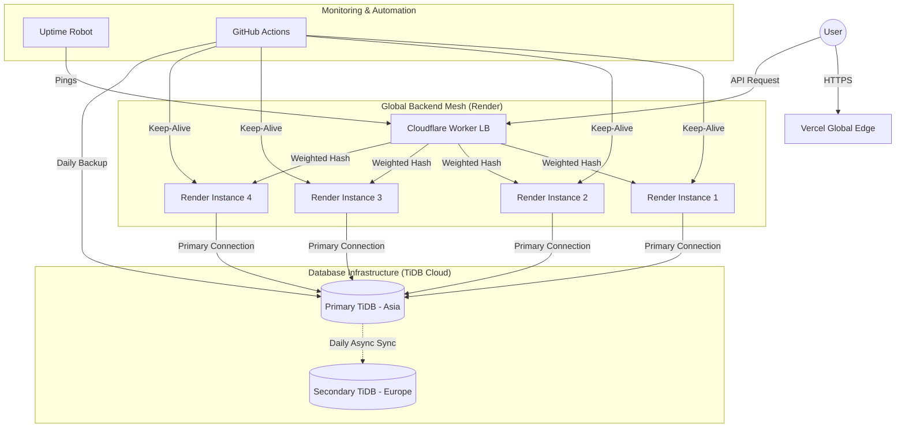

# ThinkSwipe: The Future of Technical Interview Prep


ThinkSwipe is a high-performance, mobile-first technical interview simulator designed for the modern engineer. Built with a TikTok-style infinite feed, it provides instantaneous, high-signal interview practice across DSA, System Design, and HR behavioral categories.

---

## 🏗️ High-Level Design (HLD)

The ThinkSwipe architecture is built for global low-latency and high availability, leveraging a distributed cloud edge network.



---

## 🛠️ Low-Level Design (LLD)

### Data Persistence & Reliability Logic
ThinkSwipe implements a robust database synchronization strategy to ensure zero data loss and multi-region disaster recovery.


1. **Active/Passive DB Strategy**: 
   - Operations occur on the **Primary TiDB Cluster (AWS ap-southeast-1)**.
   - A dedicated **GitHub Action** performs a daily SQL & CSV dump of the primary cluster.
2. **Synchronization Protocol**:
   - The dump is automatically synchronized to the **Secondary TiDB Cluster (AWS eu-central-1)**.
   - The sync process uses a `REPLACE INTO` logic and `SET FOREIGN_KEY_CHECKS=0` to ensure seamless data updates even in restricted system environments.
3. **Artifact Retention**: Every backup run generates downloadable `.sql.gz` and `.zip` (CSV) artifacts for offline auditing.

---

## ✨ Key Features

### 1. Instant Practice Feed
Experience a distraction-free, swipeable interface that serves high-quality interview questions instantly.
- **Categories**: DSA (Data Structures), System Design, HR Behavioral.
- **Looping Mechanism**: Custom client-side infinite loop ensures you never run out of practice.

### 2. AI-Powered Evaluation
Get immediate feedback on your answers with a proprietary scoring algorithm.
- **Feedback Loop**: Detailed feedback and a 1-10 score are provided for every attempt.
- **Model Solutions**: Reveal industry-standard answers to compare against your approach.


### 3. Progressive Web App (PWA)
Install ThinkSwipe on any device for a native-like experience with offline capabilities and instant loading.

---

## 🚀 Tech Stack

| Component | Technology |
| :--- | :--- |
| **Frontend** | React 18, Vite, TailwindCSS (optional), Axios |
| **Backend** | Spring Boot 3, Java 17, Hibernate, MySQL Driver |
| **Edge/LB** | Cloudflare Workers (JavaScript) |
| **Database** | TiDB Cloud (Primary & Secondary Clusters) |
| **Hosting** | Vercel (Frontend), Render (Backend Instances) |
| **DevOps** | GitHub Actions (Sync, Backup, Keep-Alive) |
| **Monitoring** | Uptime Robot |

---

## 📊 Infrastructure Details

### Backend Instances (Render)
ThinkSwipe uses a distributed pool of backends to handle load:
- **swipe-render1**: `https://thinkswipe.onrender.com`
- **9ahs-render2**: `https://thinkswipe-9ahs.onrender.com`
- **9mg2-render3**: `https://thinkswipe-9mg2.onrender.com`
- **i5tn-render4**: `https://thinkswipe-i5tn.onrender.com`

### Load Balancer & Edge
The master endpoint is managed by a Cloudflare Worker performing weighted round-robin distribution:
- **Endpoint**: `https://winter-lake-7b8f.raviattrash2-thinkswipe1.workers.dev`

### Reliability & Uptime
- **Keep-Alive**: A 14-minute interval GitHub Action ensures Render backends never go into sleep mode.
- **Monitoring**: Uptime Robot tracks the Cloudflare Worker availability 24/7.

---

## 💾 Database Access

| Cluster | Region | Host |
| :--- | :--- | :--- |
| **Primary** | Asia (ap-southeast-1) | `gateway01.ap-southeast-1.prod.aws.tidbcloud.com` |
| **Secondary** | Europe (eu-central-1) | `gateway01.eu-central-1.prod.aws.tidbcloud.com` |

---

## 🛠️ Getting Started

### Backend Setup (Java/Maven)
```bash
# Navigate to backend
cd Interview_App/backend
# Build and run
mvn spring-boot:run
```

### Frontend Setup (Node/Vite)
```bash
# Navigate to frontend
cd Interview_App/frontend
# Install and dev
npm install
npm run dev
```

---

<p align="center">
  Built with ❤️ for the engineering community.
</p>
